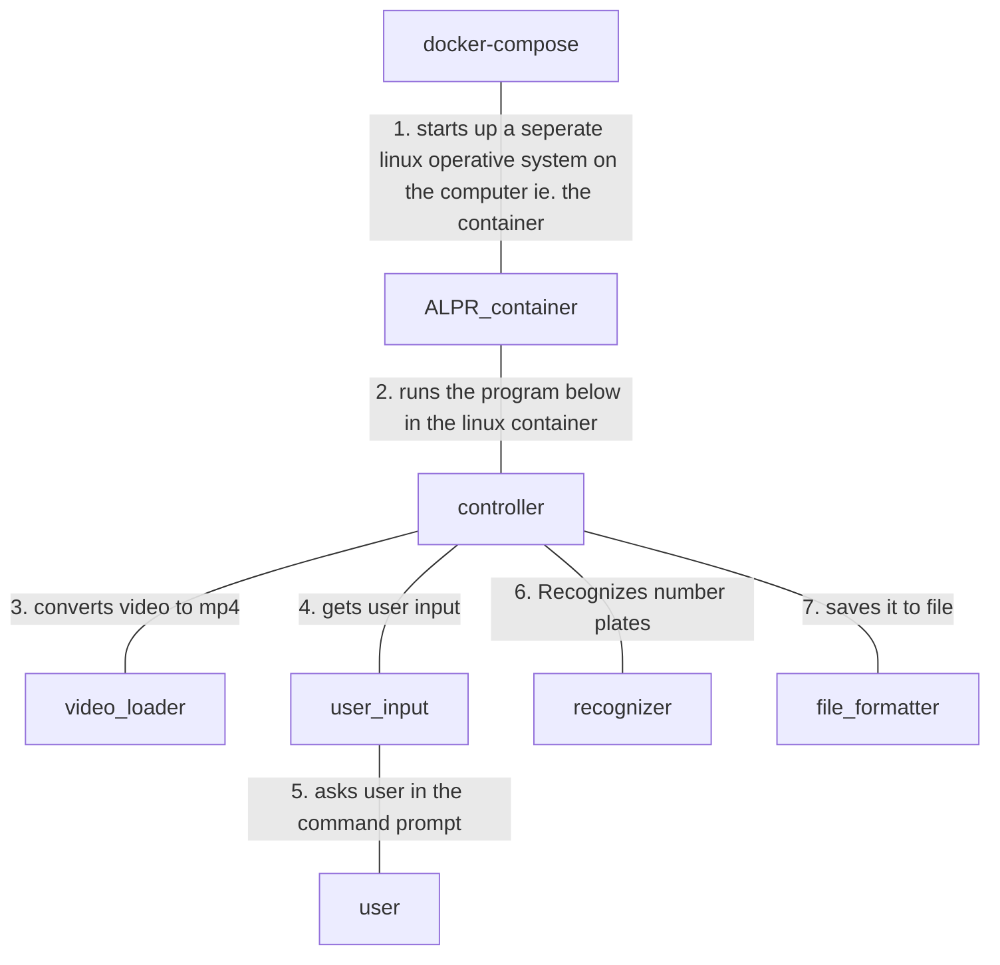

# ALPR for students
This is a simplified program that takes in video and outputs what numberplates are present in the video in a specified file format. The program needs a small amount of setup.

The explanations given are meant for students, who are not related to any computer scientific field.

## How to use
To use the program, there is some setup to do, before the program can be used.

### Setup
First install the following programs:
- git (https://git-scm.com/book/en/v2/Getting-Started-Installing-Git)
- docker (https://docs.docker.com/engine/install/)
- docker-compose (https://docs.docker.com/compose/install/)

To verify they are already on your system or installed correctly, give these commands to the terminal:
- `git --version`
- `docker run hello-world`
- `docker-compose --version`

After this installation proces, go into the directory you want to have this program installed, using the terminal window:

`cd /path/to/your/destination`
This path can be anything you like, as long as it points to a folder on your computer.

Copy the program down on your computer with the following command:
- `git clone https://github.com/TRG-BUILD/ALPR.git`

Go into the directory 
- `cd alpr`

Then build the application so it can be used (This might take a couple of minutes).
- `docker-compose build`

To be able for the program to access the videos the program has to analyze, you have to accept filesharing between the docker container and your host machine (the operative system your computer is running)

If you are using mac, this should not be an issue.

However, if you use windows, you need a bit of setup.
You need to activate Hyper-V, which is a windows setting controlling if you can use machine learning and other similar high performance tasks.
You can follow this guide:
- `https://docs.microsoft.com/en-us/virtualization/hyper-v-on-windows/quick-start/enable-hyper-v`

Then, you need to make sure your docker container and your host machine shares the same resource.
This is done by opening Docker Desktop (should already be installed through Docker) and finding your File Sharing and adding the `path/to/your/destination/alpr` path to your resources.
The official documentation:
- `https://docs.docker.com/desktop/windows/#file-sharing`

With this, the setup is then done and you can start analyzing videos.

### Using the program
Make sure your terminal is in `path/to/your/destination` you defined before.
Then change directory (cd) into the program

- `cd alpr`

Put the files you want to analyze into the alpr/input_videos/ folder. (Preferably mp4 files)

Then run the container and follow the instructions.
- `docker-compose run alpr`

The program will then analyze each video. Expect roughly double to triple the video length in time pr. video.
(This of course depends on your own computer)

When done, all videos have been analyzed and created as files in the alpr/export_files/ folder.

## How is the program set up?
The program is setup given the following diagram:



The program primarily functions through its `Dockerfile`. The `Dockerfile` creates a seperate, small linux installation on the machine running the docker commands. This linux operative system then gets just the things installed which are necessary to make the different machine learning models and python scripts work. This makes it possible to skip all the unnecessary installation process of the different machine learning models and dependencies, as well make this program possible to run on any computer, since it basically is its own linux distribution.

The program has a `/src` folder which contains the controller, the user_input, the recognizer, the file_formater and the video_converter.

The controller calls the user_input, the video_converter, the recognizer and the file_formatter in this order.

The user_input takes all relevant user_input from the user. Where to find the video, what file format is wanted, etc.

The video_converter checks if the chosen video (or set of videos) is in a correct format. If not, it will create a new video file based on the given video to an understandable format.

The recognizer uses the chosen ALPR/ANPR machine learning algorithm, which have been installed. The Dockerfile installs different models which can be selected by the user.

The file_formater takes the list of recognized numberplates and turns it into the chosen file format, also making sure the data is presented as the user wants it.

## Supported Models and Format
Here is a list and description of what machine learning models and formats are used.

### Supported ALPR algorithms
Presently, only openalpr is a supported machine learning model.

When openalpr is run on a video file, it gives information following this structure:
```json
{
    "version": 2,
    "data_type": "alpr_results",
    "epoch_time": 1651662133289,
    "img_width": 640,
    "img_height": 480,
    "processing_time_ms": 68.646896,
    "regions_of_interest": [],
    "results": [
        {
            "plate": "GJJNE",
            "confidence": 79.056992,
            "matches_template": 0,
            "plate_index": 0,
            "region": "",
            "region_confidence": 0,
            "processing_time_ms": 9.1742,
            "requested_topn": 1000,
            "coordinates": [
                {
                    "x": 337,
                    "y": 221
                },
                {
                    "x": 412,
                    "y": 210
                },
                {
                    "x": 416,
                    "y": 225
                },
                {
                    "x": 340,
                    "y": 237
                }
            ],
            "candidates": [
                {
                    "plate": "GJJNE",
                    "confidence": 79.056992,
                    "matches_template": 0
                },
                {
                    "plate": "GJJRE",
                    "confidence": 73.007217,
                    "matches_template": 0
                },
                {
                    "plate": "GJJHE",
                    "confidence": 70.58799,
                    "matches_template": 0
                },
                {
                    "plate": "GJJZE",
                    "confidence": 69.603333,
                    "matches_template": 0
                },
                {
                    "plate": "2JJNE",
                    "confidence": 68.579994,
                    "matches_template": 0
                },
                {
                    "plate": "2JJRE",
                    "confidence": 62.530212,
                    "matches_template": 0
                },
                {
                    "plate": "2JJHE",
                    "confidence": 60.110992,
                    "matches_template": 0
                },
                {
                    "plate": "2JJZE",
                    "confidence": 59.126328,
                    "matches_template": 0
                }
            ]
        }
    ],
}
```

### Supported file formats
Presently, only .csv is a supported format.

When .csv is chosen as the expected file format, it gives information following this structure with example data shown here:
```csv
    start_time;end_time;frames;plate;lowest_confidence;highest_confidence;
    00:00:00;00:00:01;1;GJJNE;79.056992;79.056992;
    00:00:01;00:00:02;2;KI006SD;90.544319;93.555351;
    ...
```